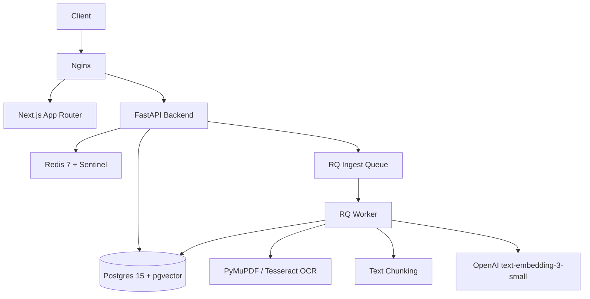

# AGENTS.md

Guidance for AI coding agents working in this repository.

## Repository Overview

**PDFTalk v2.0** is a production SaaS that lets users upload PDFs and chat with them through a Retrieval-Augmented Generation (RAG) pipeline.
It handles file upload, text extraction, text chunking, embedding generation, vector storage, and an LLM-based query system.

## Technology Stack

- **Backend**: Python 3.12, FastAPI (async), SQLAlchemy 2 async + asyncpg, Alembic, pgvector (Postgres 15), Redis 7 + RQ, OpenAI, PyMuPDF, pytesseract. Package manager: **uv**.
- **Frontend**: Next.js 15.5 (App Router), React 19.2, TypeScript 5, Tailwind CSS 4, pnpm 11.6, react-markdown, react-dropzone, react-hook-form + zod.
- **Infrastructure**: AWS Lightsail (2 vCPU/2 GB RAM), Nginx reverse proxy, Docker Compose, GitHub Actions (CI + deploy).
- **Observability**: Prometheus, Grafana, Alertmanager (on-demand profile only).
- **Rate Limiting**: Sentinel v1.2.0 (vendored).

## Architecture

## Repository Structure

- `backend/`: API and server-side application (FastAPI). See `backend/AGENTS.md`.
- `frontend/`: Client application (Next.js). See `frontend/AGENTS.md`.
- `infra/`: Nginx configurations and operational scripts. See `infra/AGENTS.md`.
- `monitoring/`: Configuration for Prometheus, Grafana, and Alertmanager.

## Major Data Flows

1. **User Request Flow**: User Request → Nginx → Next.js (if UI) or FastAPI (if API) → Authentication → Route Handler → Service → Database → Response.
2. **Document Ingestion Flow**: Client `POST /documents/initiate-upload` → S3 Presigned URL PUT → Client `POST /documents/confirm-upload` → Backend enqueues RQ job → Worker (Extract → Chunk → Embed → Store) → Postgres.
3. **Query Flow**: Client `POST /query/ask` (fetch API) → API streams tokens via SSE (`gpt-4o-mini`) using pgvector similarity search.

## Application Entry Points

- **Backend**: `backend/app/main.py` (FastAPI app initialized here, NOT `backend/main.py`).
- **Frontend**: `frontend/src/app/` (App Router).
- **Worker**: `backend/Dockerfile.worker` runs Python workers via RQ.

## Environment Configuration

- Environment variables are defined via `.env.local` or `.env.docker`.
- **Backend Configuration**: Handled by `pydantic-settings` in `backend/app/core/config.py`.
- **Frontend Configuration**: Handled by `zod` validation in `frontend/src/env.ts` (e.g., `NEXT_PUBLIC_API_URL`).
- **Sentinel Limiter**: Needs `SENTINEL_REDIS_URL`, `ANONYMOUS_COOKIE_SECRET`.
> **Do not expose secret values like `JWT_SECRET_KEY` or `OPENAI_API_KEY` anywhere.**

## Development Commands

- **Backend Dev**: `make dev` (runs `uv run uvicorn app.main:app --reload`).
- **Backend Tests**: `make test` (runs `pytest`).
- **Infrastructure**: `docker compose up -d` (production core); `docker compose --profile observability up -d` (monitoring stack).

## Testing Strategy

- **Backend Tests**: Pytest with `asyncio_mode=auto`. Uses in-memory SQLite (schema rebuilt per test), `fakeredis`, and `moto` for S3. See `backend/tests/`.
- **Coverage**: Merges require at least 61% backend test coverage.

## Deployment

- Handled by GitHub Actions (`.github/workflows/deploy.yml`).
- Docker Compose is used on the server to spin up `postgres`, `redis`, `api`, `worker`, `frontend`, `nginx`, and `sentinel-redis`.

## Critical Invariants (DO NOT BREAK)

- **Upload Quota**: `PENDING_UPLOAD` status counts towards user quota to prevent abuse.
- **Worker Async Context**: Workers run sync code calling async services via `asyncio.run()`. Each call creates a fresh loop. Do not share loop-bound pools across loops.
- **Exceptions**: Never raise `HTTPException` directly from services. Use typed exceptions from `app/exceptions.py`.
- **Metrics**: Prometheus metrics must be module-level singletons (never instantiated inside functions).
- **HSTS Header**: Controlled by Nginx. Do NOT duplicate it in the FastAPI middleware stack.
- **Sentinel Rate Limiting**: Required dedicated Redis instance with `maxmemory-policy noeviction`.

## Known Fragile Areas

- **Auth Dependency Bug**: A non-UUID JWT `sub` causes an unhandled 500 at `backend/app/auth/dependencies.py:78`.
- **Worker OOM Risks**: OCR (Tesseract) parallelism is kept at 1 in the worker container to avoid OOM kills on the 2GB server.
- **EventSource (SSE) Limitations**: Browsers cannot POST with `EventSource`. The frontend uses `fetch` with a `ReadableStream` instead.
