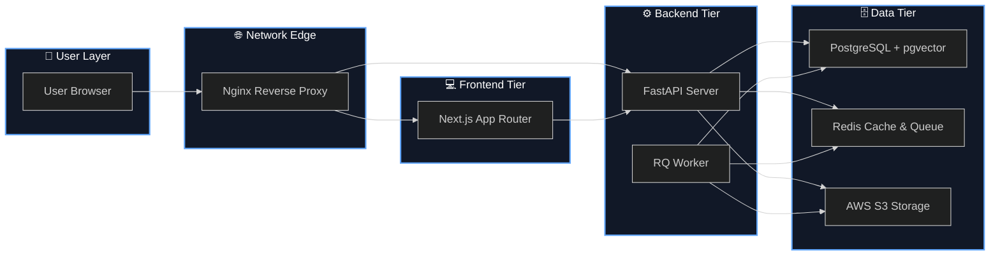
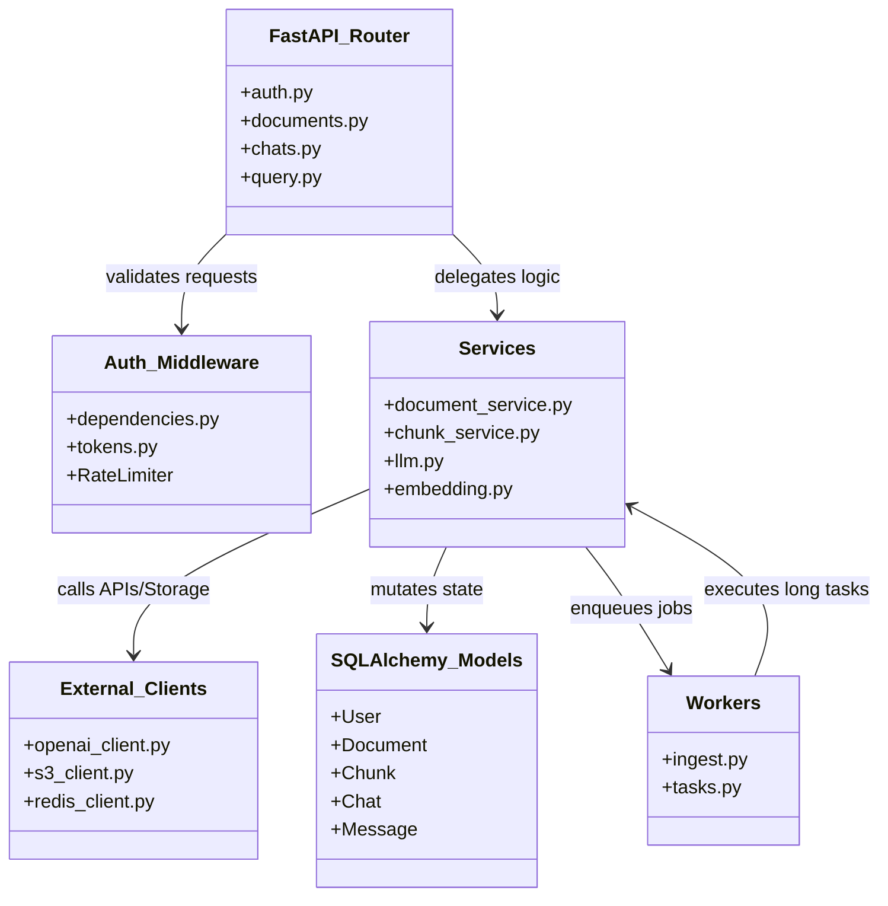
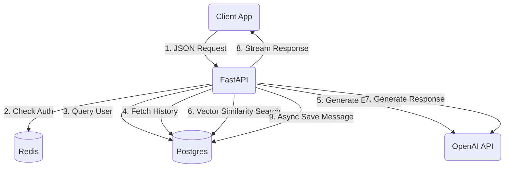
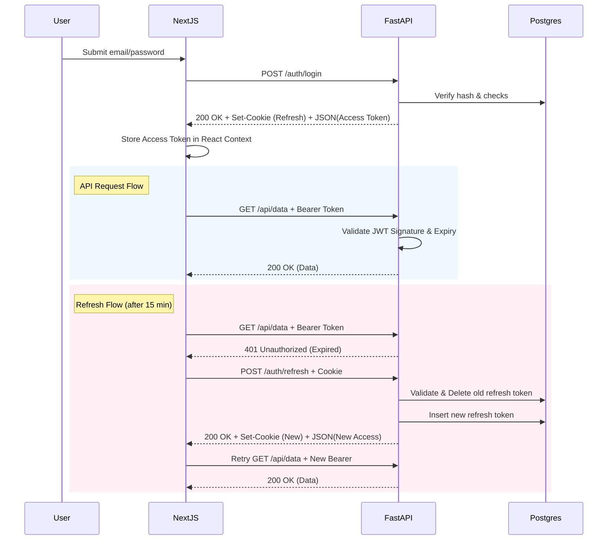
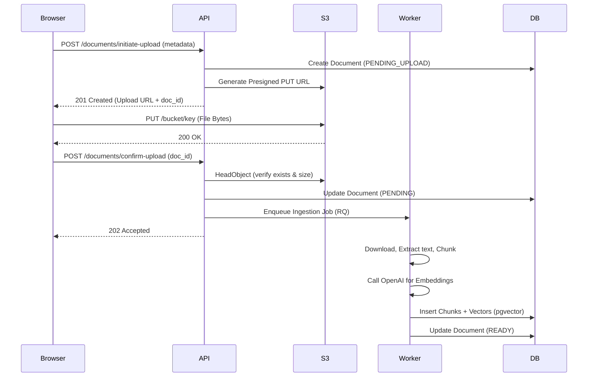
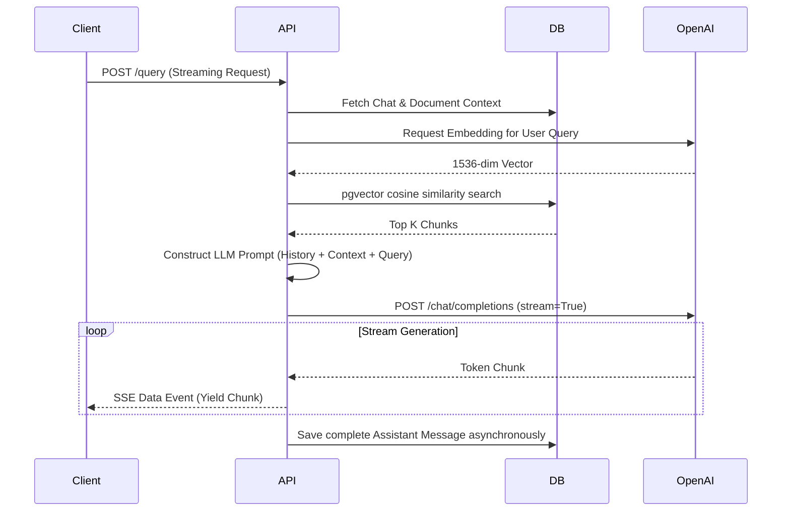
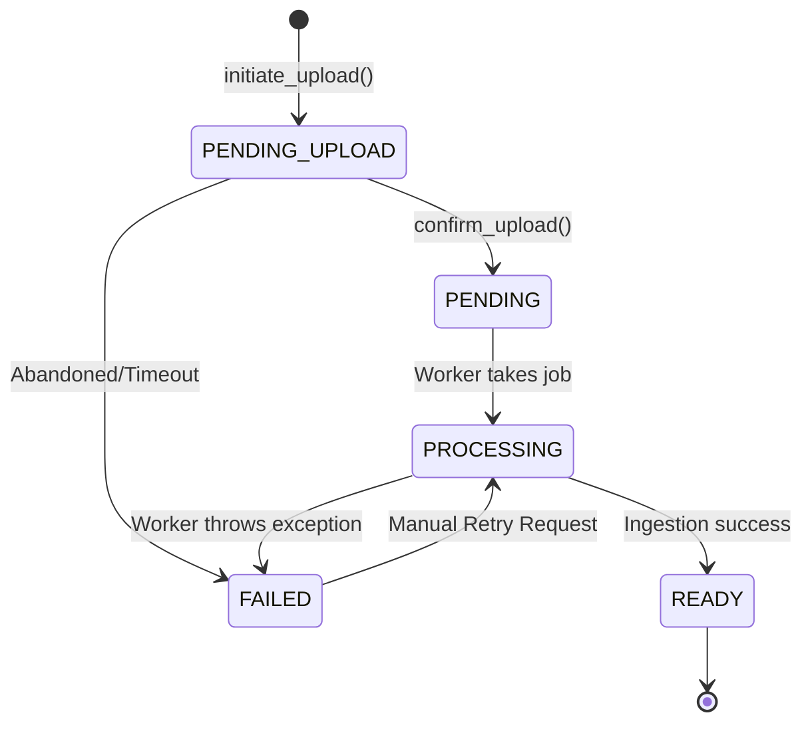

# Phase 14 — Architecture Review

This document provides a comprehensive architectural review of the PDFTalk platform, complete with Mermaid diagrams illustrating system components, sequence flows, and lifecycle processes.

## 1. High-Level Architecture Diagram

The system follows a typical modern 3-tier architecture with a Next.js frontend, a FastAPI backend, and a robust data/caching layer.

## 2. Component Diagram

The Backend component is broken down into Domain-Driven Design (DDD) layers.

## 3. Data Flow Diagram

## 4. Authentication Lifecycle

PDFTalk uses an OAuth2 Bearer token flow with short-lived JWT access tokens in memory and long-lived Refresh tokens in HTTP-only cookies.

## 5. Document Upload Lifecycle

PDFTalk uses a Presigned URL architecture to offload massive file uploads directly to AWS S3, sparing the FastAPI server's memory and bandwidth.

## 6. Request Lifecycle (RAG / Streaming Chat)

The query endpoint executes a Retrieval-Augmented Generation (RAG) pipeline and streams the output directly to the client via Server-Sent Events (SSE).

## 7. Queue Lifecycle

