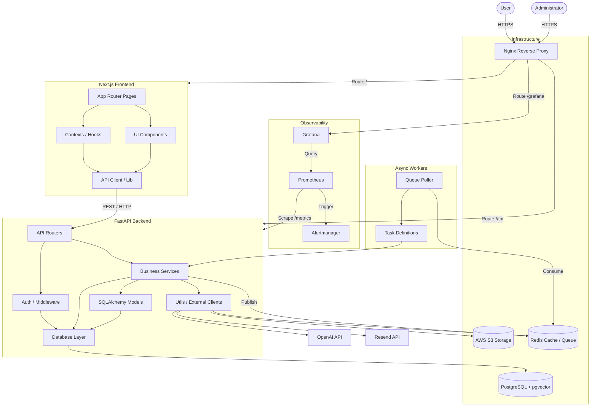

# Phase 1 — Repository Mapping

This document provides a comprehensive mapping of the PDFTalk repository. It breaks down every directory, explaining its existence, architectural layer, responsibility, and dependencies.

## Directory Map

### Root Level
The root directory acts as the orchestrator for the entire system, managing deployment, continuous integration, and high-level configurations.

*   **`.github/workflows`**:
    *   *Purpose*: Contains GitHub Actions CI/CD pipelines (`ci.yml` for testing and linting, `deploy.yml` for automated deployment to AWS Lightsail).
    *   *Responsibility*: CI/CD.
    *   *Layer*: DevOps / CI/CD.
    *   *Depends On*: Project files, test suites, Docker, AWS credentials.
    *   *Depended Upon By*: GitHub Actions runner.
*   **`backend`**:
    *   *Purpose*: Contains the entire Python backend (FastAPI application, Celery workers, Alembic migrations, Pytest suite).
    *   *Responsibility*: Business logic, data persistence, ML inference (embeddings, LLM), authentication.
    *   *Layer*: API / Service / Worker Layer.
    *   *Depends On*: Postgres (pgvector), Redis, S3, OpenAI, Resend.
    *   *Depended Upon By*: `frontend` (via HTTP API), `monitoring` (for metrics).
*   **`frontend`**:
    *   *Purpose*: Contains the Next.js React application.
    *   *Responsibility*: User interface, client-side routing, state management, interacting with the backend API.
    *   *Layer*: Presentation / UI Layer.
    *   *Depends On*: `backend` (API endpoints).
    *   *Depended Upon By*: End users.
*   **`infra`**:
    *   *Purpose*: Infrastructure-as-code and server configurations.
    *   *Responsibility*: Reverse proxying (Nginx), TLS termination, automated deployment scripts, S3 lifecycle policies.
    *   *Layer*: Infrastructure / Networking.
    *   *Depends On*: Host OS, Docker networking, Backend/Frontend services.
    *   *Depended Upon By*: External web traffic (routes to backend/frontend).
*   **`monitoring`**:
    *   *Purpose*: Observability stack configuration.
    *   *Responsibility*: Scraping metrics (Prometheus), dashboarding (Grafana), alerting (Alertmanager).
    *   *Layer*: Observability / SRE.
    *   *Depends On*: Backend (for `/metrics`), Host OS, Docker daemon.
    *   *Depended Upon By*: SREs / Admins.

---

### Backend (`/backend`)
The backend is structured using Domain-Driven Design (DDD) principles mixed with standard MVC/Service layering.

*   **`backend/app`**: The core FastAPI application package.
    *   **`app/auth`**:
        *   *Purpose*: Core security implementations.
        *   *Responsibility*: Password hashing, JWT generation/validation, dependency injection for secure routes.
        *   *Layer*: Security / Middleware.
        *   *Depends On*: `app/core/config`, `app/models`, `app/db`.
        *   *Depended Upon By*: `app/routers`, `app/middleware`.
    *   **`app/core`**:
        *   *Purpose*: Global configurations.
        *   *Responsibility*: Pydantic `BaseSettings` for environment variables.
        *   *Layer*: Configuration.
        *   *Depends On*: Environment `.env`.
        *   *Depended Upon By*: Almost everything in `app`.
    *   **`app/db`**:
        *   *Purpose*: Database connection and ORM setup.
        *   *Responsibility*: Async engine creation, session management, SQLAlchemy declarative base.
        *   *Layer*: Data Access Layer (DAL).
        *   *Depends On*: `app/core`, Postgres.
        *   *Depended Upon By*: `app/services`, `app/models`, `app/auth`.
    *   **`app/middleware`**:
        *   *Purpose*: Request interception.
        *   *Responsibility*: Request logging, CORS, rate limiting checks, security headers.
        *   *Layer*: Middleware / HTTP.
        *   *Depends On*: FastAPI, `app/utils`.
        *   *Depended Upon By*: `app/main.py`.
    *   **`app/models`**:
        *   *Purpose*: SQLAlchemy database models.
        *   *Responsibility*: Defines table schemas (User, Document, Message, Chat, Chunk, JobLog).
        *   *Layer*: Data Model Layer.
        *   *Depends On*: `app/db/base`.
        *   *Depended Upon By*: `app/services`, `alembic`, `app/routers` (indirectly).
    *   **`app/routers`**:
        *   *Purpose*: API endpoints (Controllers).
        *   *Responsibility*: Route definitions, input validation (Pydantic), calling services, returning HTTP responses.
        *   *Layer*: Presentation (API) Layer.
        *   *Depends On*: `app/services`, `app/auth/dependencies`.
        *   *Depended Upon By*: FastAPI Router in `app/main.py`.
    *   **`app/services`**:
        *   *Purpose*: Core business logic.
        *   *Responsibility*: Document parsing, chunking, embedding generation, LLM querying, email sending, user management.
        *   *Layer*: Service / Business Logic Layer.
        *   *Depends On*: `app/models`, `app/db`, `app/utils`, External APIs (OpenAI).
        *   *Depended Upon By*: `app/routers`, `app/workers`.
    *   **`app/utils`**:
        *   *Purpose*: Stateless helper functions and external client wrappers.
        *   *Responsibility*: Redis client, S3 client, OpenAI client, logging configuration, metric tracking.
        *   *Layer*: Utility / Infrastructure wrappers.
        *   *Depends On*: `app/core`.
        *   *Depended Upon By*: `app/services`, `app/middleware`, `app/workers`.
    *   **`app/workers`**:
        *   *Purpose*: Asynchronous background processing.
        *   *Responsibility*: Queue polling, document ingestion, retries, failure handling.
        *   *Layer*: Background / Async Layer.
        *   *Depends On*: `app/services`, `app/utils/redis_client`.
        *   *Depended Upon By*: Triggered by messages published from `app/services/document_service`.
*   **`backend/alembic`**:
    *   *Purpose*: Database migration scripts.
    *   *Responsibility*: Schema version control.
    *   *Layer*: Database Management.
    *   *Depends On*: `app/models`.
    *   *Depended Upon By*: CI/CD, Deployment scripts.
*   **`backend/scripts`**:
    *   *Purpose*: Maintenance and operational scripts.
    *   *Responsibility*: Orphan S3 cleanup, RAG evaluation, benchmarking, quota reports.
    *   *Layer*: Operations.
*   **`backend/tests`**:
    *   *Purpose*: Unit and integration tests.
    *   *Layer*: Testing.

---

### Frontend (`/frontend`)
The frontend uses the Next.js App Router paradigm.

*   **`frontend/src/app`**:
    *   *Purpose*: Next.js App Router pages and layouts.
    *   *Responsibility*: Server-side and client-side page rendering, routing.
    *   *Layer*: Presentation (Page) Layer.
    *   *Depends On*: `src/components`, `src/hooks`, `src/lib`.
    *   *Depended Upon By*: Next.js framework.
*   **`frontend/src/components`**:
    *   *Purpose*: Reusable React components.
    *   *Responsibility*: UI elements (Modals, Skeletons, Sidebars, ThemeToggles).
    *   *Layer*: Presentation (Component) Layer.
*   **`frontend/src/contexts`**:
    *   *Purpose*: Global React state.
    *   *Responsibility*: `AuthContext` (managing user sessions), `ChatContext` (managing active chats).
    *   *Layer*: State Management Layer.
*   **`frontend/src/hooks`**:
    *   *Purpose*: Custom React hooks.
    *   *Responsibility*: Shared UI logic (e.g., `useCountdown`, `usePasswordRules`).
    *   *Layer*: UI Logic Layer.
*   **`frontend/src/lib`**:
    *   *Purpose*: API wrappers, schemas, and utility functions.
    *   *Responsibility*: Axios instances, Pydantic/Zod schemas, API call wrappers (`auth.api.ts`, `documents.api.ts`).
    *   *Layer*: API Client Layer.
*   **`frontend/src/providers`**:
    *   *Purpose*: High-level component providers.
    *   *Responsibility*: Wrapping the app in Theme/Auth contexts.

---

## Dependency Graph (Mermaid)

