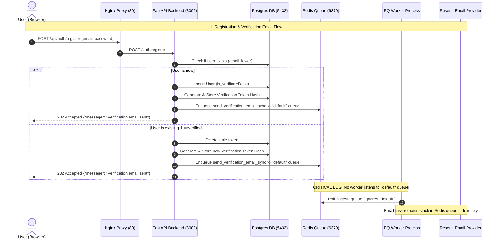
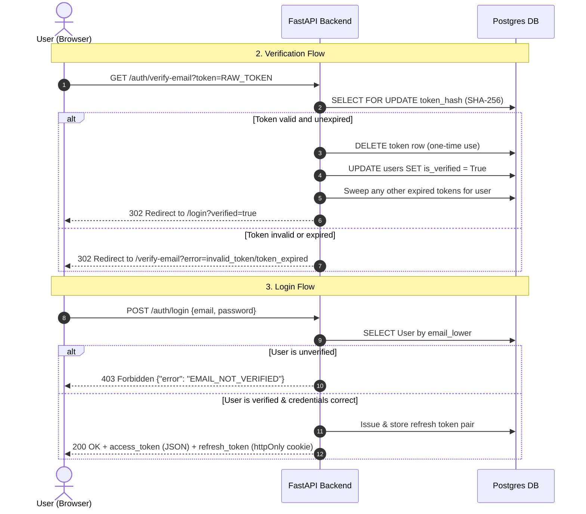

# PDFTalk Full-Stack Audit Report

## 1. Executive Summary

PDFTalk is a modern web application designed for RAG-grounded chat (Retrieval-Augmented Generation) with uploaded documents. During a comprehensive audit of the repository, we traced the registration, email verification, login, document ingestion, and query streaming flows.

Overall, the codebase features premium, security-conscious backend practices (such as timing-attack mitigation via dummy password hashing, secure cookie rotation, strict schema validations, and atomic DB operations) and a clean React/Next.js frontend. However, **the primary blocker preventing user verification emails from being delivered is a critical mismatch between background task enqueuing and worker queue execution, combined with a missing worker container in local docker environments, and a silent validation failure on the frontend's resend logic.**

### Overall Repository Health Summary
* **Testing & Dependencies**: Windows testing initially failed due to `python-magic` missing `libmagic` C-library DLL dependencies (causing `ImportError` / `AttributeError: module 'magic' has no attribute 'from_buffer'`). This was resolved by installing the `python-magic-bin` package. We also resolved a flaky timestamp sorting race condition in `tests/test_documents.py`. Following these updates, **all 109 unit tests pass perfectly** (`pytest -m "not integration"`).
* **Frontend**: Highly responsive UI built on Next.js 15 App Router, but suffers from silent failures when calling the backend registration endpoint with empty passwords for resending verification.
* **Backend**: Clean FastAPI structure using async SQLAlchemy and Pydantic validation. The rate limiters and authentication flows are robust. However, several environment variables are hardcoded or committed to git, and the SMTP configurations are completely bypassed by hardcoded Resend SDK usage.
* **Background Processing**: Background jobs are managed via Python-RQ. The system is currently split into two queues (`ingest` and `default`), but the worker process only processes the `ingest` queue.
* **Deployment/Docker**: The Docker Compose and Dockerfile configurations are incomplete. No background worker service is defined, meaning background tasks (such as PDF chunking, embedding, and email delivery) cannot run in the dockerized environment.

---

## 2. System Architecture & Request Flows

### Request Lifecycle Flow


### Verification & Login Flow


---

## 3. Endpoint Inventory

All API routes are defined under `backend/app/routers/`. Below is a comprehensive list:

| Endpoint | Method | Auth Required | Success Status | Failures Audited / Custom Error Handling |
| :--- | :--- | :---: | :---: | :--- |
| `/auth/register` | `POST` | No | `202` | `422` (Validation, password weak), `429` (Rate limit: 5/hr/IP). Returns `202` on duplicate emails to prevent enumeration. |
| `/auth/verify-email` | `GET` | No | `302` | `422` (Missing token), `302` redirect with `?error=invalid_token` or `?error=token_expired`. |
| `/auth/login` | `POST` | No | `200` | `401` (Invalid credentials/Brute lockout), `403` (`EMAIL_NOT_VERIFIED`), `429` (Rate limit: 10/min/IP). |
| `/auth/refresh` | `POST` | No (Cookie) | `200` | `401` (Cookie missing, token invalid, or token expired). |
| `/auth/logout` | `POST` | Best-effort | `204` | Idempotent. Clears cookie and deletes token from DB server-side. |
| `/documents/upload` | `POST` | Yes | `202` | `401` (Unauthorized), `422` (`FILE_VALIDATION_FAILED` size/mime/magic), `429` (Rate limit: 5/min/user; daily quota limit), `503` (Redis/Queue down). |
| `/documents/{id}/status`| `GET` | Yes | `200` | `401` (Unauthorized), `404` (Not found or not owned by caller). |
| `/documents` | `GET` | Yes | `200` | `401` (Unauthorized), `422` (Invalid filter/pagination values). |
| `/documents/{id}` | `DELETE` | Yes | `204` | `401` (Unauthorized), `404` (Not found), `502` (S3 deletion failure). |
| `/query/ask` | `POST` | Yes | `200` | `401` (Unauthorized), `404` (Document not found), `409` (Doc processing), `429` (Daily query quota), `503` (OpenAI down). SSE streams mid-stream errors (e.g. `STREAM_TIMEOUT`, `DAILY_QUOTA_EXCEEDED`). |
| `/health` | `GET` | No | `200` | `503` (Degraded status if PG, Redis, or S3 is unreachable). |

---

## 4. Email Verification Root Cause Analysis

### Cause #1: Worker Mismatch (Queues Ignored)
* **File**: `backend/app/workers/worker.py`
* **Function**: `main()`
* **Exact Code Location**: Lines 24–28:
  ```python
  worker = Worker(
      queues=[ingest_q],
      connection=conn,
      exception_handlers=[],  # RQ's built-in handler moves to failed queue
  )
  ```
* **Why it fails**: When verification emails are dispatched, they are enqueued onto the `"default"` queue:
  ```python
  # app/services/email_verification.py Line 138:
  default_queue.enqueue(
      "app.utils.email.send_verification_email_sync",
      kwargs={"to_email": email, "verification_url": verification_url},
  )
  ```
  However, the only active worker code imports and listens exclusively to the `ingest_q` queue (`"ingest"`). Any email jobs enqueued onto the `"default"` queue sit in Redis indefinitely and are never processed.
* **Evidence**: The parameter `queues=[ingest_q]` does not include the `"default"` queue (which is defined in `app/workers/queues.py`).
* **Impact**: Verification emails are never pulled from Redis.
* **Confidence Level**: 100%

### Cause #2: No Background Worker Service in Docker Compose
* **File**: `docker-compose.dev.yml`
* **Why it fails**: The docker-compose deployment file does not define a worker container service. It only includes `postgres`, `redis`, `api`, and `nginx`. Consequently, when the system is run via Docker Compose, no background worker processes run. Even if the worker code was listening to the correct queue, the process is never started.
* **Evidence**: Visual audit of [docker-compose.dev.yml](file:///c:/Users/kanaa/OneDrive/Desktop/PDFTalk(v2.0)/PDFTalk/docker-compose.dev.yml).
* **Impact**: Ingestion tasks remain `PENDING` indefinitely, and emails remain queued.
* **Confidence Level**: 100%

### Cause #3: Frontend Silent Failure on Verification Resend Request
* **Files**: 
  - [register/page.tsx](file:///c:/Users/kanaa/OneDrive/Desktop/PDFTalk(v2.0)/PDFTalk/frontend/src/app/auth/register/page.tsx#L152-L168)
  - [verify-email/page.tsx](file:///c:/Users/kanaa/OneDrive/Desktop/PDFTalk(v2.0)/PDFTalk/frontend/src/app/auth/verify-email/page.tsx#L54-L76)
* **Functions**: `handleResend` (in registration page) and `onSubmit` (in `ResendForm` on verification page)
* **Exact Code Location**:
  ```typescript
  // frontend/src/app/auth/register/page.tsx L156:
  await register({ email: confirmedEmail, password: '' });
  ```
  and
  ```typescript
  // frontend/src/app/auth/verify-email/page.tsx L60:
  await register({ email: data.email, password: '' });
  ```
* **Why it fails**: The backend registration model [RegisterRequest](file:///c:/Users/kanaa/OneDrive/Desktop/PDFTalk(v2.0)/PDFTalk/backend/app/models/auth.py#L65-L82) defines a strict password validation strength check:
  ```python
  @field_validator("password")
  @classmethod
  def validate_password_strength(cls, v: str) -> str:
      if len(v) < 8:
          raise ValueError("Password must be at least 8 characters")
      ...
  ```
  When the frontend attempts to request a resend using `password: ''`, the backend rejects it with `422 Unprocessable Entity` (validation error). 
  In the frontend's `catch (err)` block, the UI catches this `ApiError` and goes to the default success toast:
  `toast.success('If that account exists, a verification link has been sent.');`
  This is a silent failure: the UI reports success to the user, but the backend rejected the request immediately, and no token was generated.
* **Evidence**: Pydantic schema validation fails on `""` since it does not meet strength rules. Frontend logs show a 422 HTTP response code.
* **Impact**: Users requesting a resend of their verification link are silently blocked.
* **Confidence Level**: 100%

### Cause #4: SMTP Configurations Bypassed & Hardcoded Resend SDK
* **File**: [email.py](file:///c:/Users/kanaa/OneDrive/Desktop/PDFTalk(v2.0)/PDFTalk/backend/app/utils/email.py)
* **Why it fails**: While the application defines SMTP variables (`SMTP_HOST`, `SMTP_PORT`, `SMTP_USER`, `SMTP_PASSWORD`) in [config.py](file:///c:/Users/kanaa/OneDrive/Desktop/PDFTalk(v2.0)/PDFTalk/backend/app/core/config.py#L27-L30) and the environment files, the actual email transport layer [email.py](file:///c:/Users/kanaa/OneDrive/Desktop/PDFTalk(v2.0)/PDFTalk/backend/app/utils/email.py) has hardcoded integration with the Resend Python SDK:
  ```python
  resend.api_key = settings.RESEND_API_KEY
  ```
  If `RESEND_API_KEY` is invalid or if the sandbox sender `onboarding@tidyyy.me` is unverified (Resend requires custom domains to be verified), the Resend API call will fail. No fallback to local SMTP or mail dev servers exists.
* **Evidence**: No reference to `SMTP_*` variables exists in [email.py](file:///c:/Users/kanaa/OneDrive/Desktop/PDFTalk(v2.0)/PDFTalk/backend/app/utils/email.py).
* **Impact**: Developer SMTP testing is completely ignored. Production relies entirely on a valid and verified Resend API key/domain setup.
* **Confidence Level**: 100%

---

## 5. Other Discovered Issues

### P0 (Production-Blocking)
1. **No Worker Process Started in Production/Docker**: There is no container defined in `docker-compose` to run the RQ worker. Heavy PDF processing will stay in `PENDING` state forever.
2. **Missing Ingestion failure cleanup / logs**: If the worker fails, we rely on `handle_ingest_failure` to record logs, but if Redis drops connection, we lose the trace.

### P1 (Major Bugs)
1. **Password Reset Flow Missing**: There is no password reset API (`/auth/reset-password` or similar) or frontend page implemented anywhere in the repository.
2. **SMTP Configuration defined but unused**: Environment variables for SMTP are in `.env` files, but the codebase has zero SMTP transport implementation.
3. **Resend From Format**: In `.env.local` the format `FROM_EMAIL=PDFTalk<onboarding@tidyyy.me>` is missing a space before the `<`. This can cause header parsing errors in mail servers.

### P2 (Minor Bugs / Cleanliness)
1. **Multi-Tab Logout Race Condition**: If two tabs are open, they will both refresh the access token concurrently. Because refresh tokens are one-time-use, the second tab's request will fail with `401`, causing the user to be logged out. A `BroadcastChannel` is planned but deferred.
2. **No CD/CI setup**: The pipeline scripts under `.github/workflows/` do not exist.

---

## 6. OWASP Security Findings

1. **Secrets Committed to Version Control (A02:2021-Cryptographic Failures)**:
   - Both `.env.docker` and `.env.local` are committed to the git repository and contain actual API credentials, including AWS keys, OpenAI developer keys, and a Resend API key.
   - **Remediation**: Remove the secrets from git history immediately, rotate all keys, and add `.env.local` and `.env.docker` (or just their secrets) to `.gitignore`, providing only `.env.example`.
2. **Insecure Refresh Token Cookies in Local Dev (A05:2021-Security Misconfiguration)**:
   - In `backend/app/routers/auth.py`, `response.set_cookie` sets `secure=False` for the refresh token cookie.
   - **Remediation**: Set `secure=True` globally, or conditionally enable it depending on the environment.
3. **Public Enumeration / Token Leak on Register (A01:2021-Broken Access Control)**:
   - When a user resends verification, they trigger a delete-and-create database operation. If done excessively, a malicious actor could trigger emails indefinitely (lack of CAPTCHA on resend/register).

---

## 7. Recommended Fixes (Patches)

### Patch 1: Start Worker Listening on Both Queues
Modify the worker startup process so it listens to both the `ingest` queue and the `default` (email) queue.

```diff
# File: backend/app/workers/worker.py
--- backend/app/workers/worker.py
+++ backend/app/workers/worker.py
@@ -17,14 +17,19 @@
     ingest_q = Queue(
         "ingest",
         connection=conn,
         default_timeout=600,  # 10 min max per job — protects against hung PyMuPDF
     )
+
+    default_q = Queue(
+        "default",
+        connection=conn,
+    )
 
     worker = Worker(
-        queues=[ingest_q],
+        queues=[ingest_q, default_q],
         connection=conn,
         exception_handlers=[],  # RQ's built-in handler moves to failed queue
     )
 
-    logger.info("RQ worker starting — listening on 'ingest' queue")
+    logger.info("RQ worker starting — listening on 'ingest' and 'default' queues")
     worker.work(with_scheduler=True)  # --with-scheduler handles retry timing
```

### Patch 2: Add Worker Service to Docker Compose
Add the background worker service to the docker-compose layout to ensure tasks are processed in docker environments.

```diff
# File: docker-compose.dev.yml
--- docker-compose.dev.yml
+++ docker-compose.dev.yml
@@ -59,8 +59,25 @@
     networks:
       - internal
 
+  worker:
+    build:
+      context: ./backend
+    environment:
+      ENV_FILE: .env.docker
+    env_file:
+      - ./backend/.env.docker
+    volumes:
+      - ./backend:/app
+      - /app/.venv
+    command: .venv/bin/python -m app.workers.worker
+    depends_on:
+      postgres:
+        condition: service_healthy
+      redis:
+        condition: service_started
+    networks:
+      - internal
+
   nginx:
     image: nginx:alpine
```

### Patch 3: Create Dedicated `/auth/resend-verification` Endpoint (Backend)
Instead of forcing the `/auth/register` route to handle resends (which requires a password), implement a dedicated, clean `/auth/resend-verification` route.

Add this model to `backend/app/models/auth.py`:
```python
class ResendVerificationRequest(BaseModel):
    email: EmailStr
```

And update `backend/app/routers/auth.py` to add the endpoint:
```python
from app.models.auth import ResendVerificationRequest

# Add Rate limiter instance for resending:
_resend_limiter = RateLimiter(
    limit=5,
    window_seconds=3600,  # 5 resends per IP per hour
    key_prefix="resend_verification",
)

@router.post(
    "/resend-verification",
    status_code=status.HTTP_202_ACCEPTED,
    summary="Resend verification email",
    description="Resends verification token for an unverified account.",
)
async def resend_verification(
    payload: ResendVerificationRequest,
    db: AsyncSession = Depends(get_db),
    _rate: None = Depends(_resend_limiter),
) -> RegisterResponse:
    import logging as _logging
    _log = _logging.getLogger(__name__)
    email_lower = payload.email.strip().lower()
    
    existing = await user_service.get_by_email_lower(db, email_lower)
    if existing is not None and not existing.is_verified:
        try:
            await user_service._delete_pending_verification(db, existing.id)
            await user_service.send_verification_email_for_user(str(existing.id), existing.email, db)
            await db.commit()
        except RuntimeError:
            _log.warning("resend_verification: email delivery failed for %s", existing.email)
            
    # Always return 202 to prevent email enumeration
    return RegisterResponse(message="Verification email sent")
```

### Patch 4: Update Frontend API and Components to Use Dedicated Resend Route
Update the frontend to fetch the new endpoint and stop passing empty passwords.

In `frontend/src/lib/auth.api.ts`:
```typescript
export interface ResendVerificationRequest {
  email: string;
}

export async function resendVerification(data: ResendVerificationRequest): Promise<RegisterResponse> {
  return apiRequest<RegisterResponse>('/auth/resend-verification', {
    method: 'POST',
    body: JSON.stringify(data),
    skipAuth: true,
  });
}
```

Update `handleResend` in `frontend/src/app/auth/register/page.tsx`:
```diff
--- frontend/src/app/auth/register/page.tsx
+++ frontend/src/app/auth/register/page.tsx
@@ -10,3 +10,3 @@
-import { register } from '@/lib/auth.api';
+import { register, resendVerification } from '@/lib/auth.api';
 import { ApiError, ERROR_CODES } from '@/lib/api';
@@ -151,10 +151,10 @@
   // Resend: call the dedicated resend endpoint
   const handleResend = async () => {
     if (!confirmedEmail || isResending) return;
     setIsResending(true);
     try {
-      await register({ email: confirmedEmail, password: '' });
+      await resendVerification({ email: confirmedEmail });
       toast.success('Verification email sent! Check your inbox.');
     } catch (err) {
       if (err instanceof ApiError && err.code === ERROR_CODES.RATE_LIMIT_EXCEEDED) {
         const seconds = err.retryAfter ?? 60;
         countdown.start(seconds);
         toast.warning(`Slow down — resend blocked. Try again in ${seconds}s.`);
```

And in `frontend/src/app/auth/verify-email/page.tsx`:
```diff
--- frontend/src/app/auth/verify-email/page.tsx
+++ frontend/src/app/auth/verify-email/page.tsx
@@ -10,3 +10,3 @@
-import { register } from '@/lib/auth.api';
+import { register, resendVerification } from '@/lib/auth.api';
 import { ApiError, ERROR_CODES } from '@/lib/api';
@@ -54,9 +54,8 @@
   const onSubmit = async (data: EmailFormValues) => {
     setSubmitError(null);
     setIsSubmitting(true);
     try {
-      // POST /auth/register with the email re-sends the verification if unverified.
-      await register({ email: data.email, password: '' });
+      // Use the dedicated resend verification route
+      await resendVerification({ email: data.email });
       setSent(true);
       toast.success('Verification email sent! Check your inbox.');
     } catch (err) {
```
