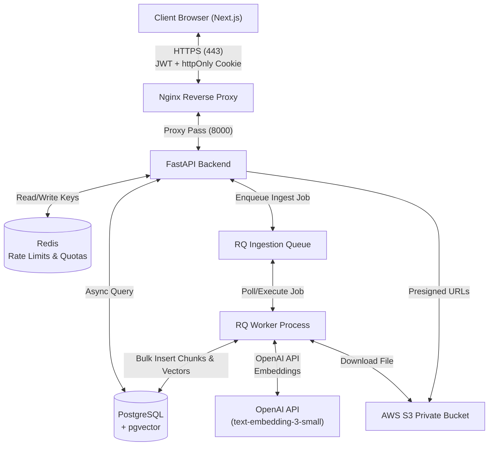
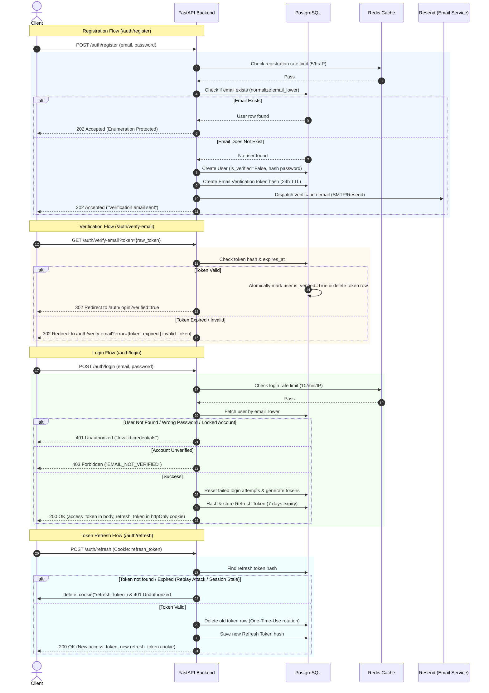
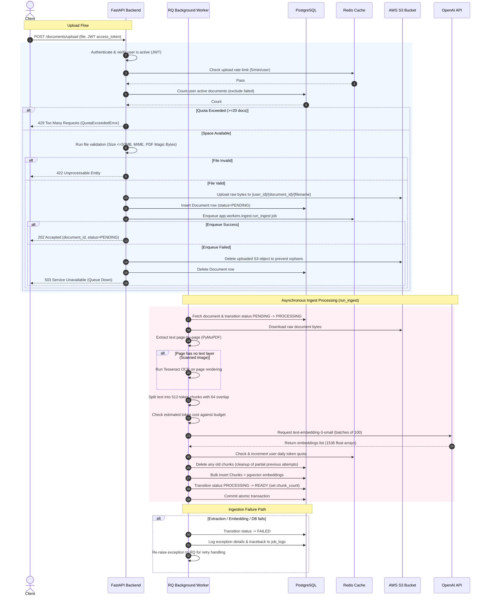
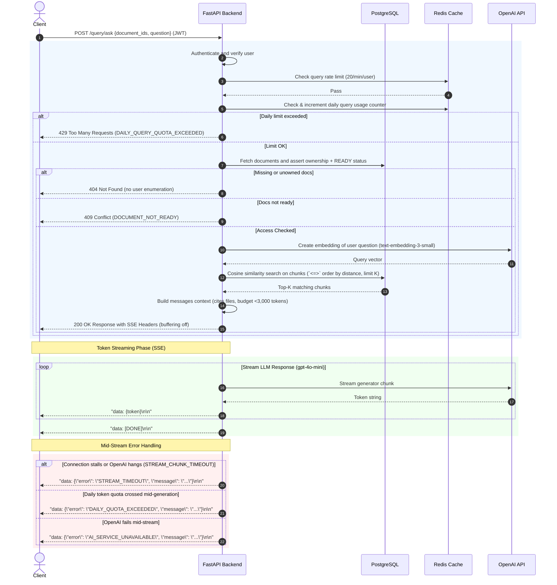

# PDFTalk — MVP Technical Analysis and Status Report

This report provides a detailed technical analysis of the **PDFTalk** project, validating its progress against the [pdftalk_mvp_tasklist.md](file:///c:/Users/kanaa/OneDrive/Desktop/PDFTalk(v2.0)/PDFTalk/my_plan/pdftalk_mvp_tasklist.md) up to **Task 53 (Phase 10 completion)**. It outlines the core architecture, maps out the happy and failure paths for each endpoint via Mermaid sequence diagrams, catalogs the endpoints, and lists the critical gaps and suggested improvements needed before the MVP can be safely launched.

---

## 1. System Architecture Overview

PDFTalk is built as a self-hosted, monorepo application using a single-instance AWS Lightsail architecture. The stack consists of:
*   **Frontend**: Next.js 14 (App Router) styled with Tailwind CSS, utilizing React Context for auth states and `fetch` with `ReadableStream` for consuming streams.
*   **Backend**: FastAPI running on Python 3.13, using SQLAlchemy (async via `asyncpg` connection pool) for PostgreSQL operations and Redis for rate-limiting, token-quota tracking, and background job queues.
*   **Workers**: RQ (Redis Queue) background process handling CPU-intensive tasks (PDF text extraction, OCR, chunking, and embedding generation).
*   **Databases**: PostgreSQL 15 + `pgvector` for structured tables and vector similarity searches.
*   **Storage**: Private AWS S3 bucket for secure, durable document storage.

---

## 2. Endpoint Connection Lifecycles (Sequence Diagrams)

### 2.1 User Authentication & Session Management
Covers `/auth/register`, `/auth/verify-email`, `/auth/login`, `/auth/refresh`, and `/auth/logout`.

### 2.2 Document Ingestion Pipeline
Covers the ingestion lifecycle starting at `/documents/upload` through the background RQ worker execution.

### 2.3 RAG-Grounded Query Path (Streaming SSE)
Covers `/query/ask` SSE Streaming flow.

---

## 3. Comprehensive Endpoint Catalog

| Endpoint | Method | Authentication | Rate Limits | Input (Payload / Query / Cookies) | Happy Path (2xx/3xx) | Failure Scenarios & Error Codes |
| :--- | :--- | :--- | :--- | :--- | :--- | :--- |
| `/auth/register` | `POST` | None | 5 / hr / IP | JSON Body: `email`, `password` | `202 Accepted` `{"message": "Verification email sent"}` | **429**: `RATE_LIMIT_EXCEEDED` **422**: Pydantic validation (weak password / malformed email) *Note: Always returns 202 if validation passes, even if the email already exists.* |
| `/auth/resend-verification` | `POST` | None | 5 / hr / IP | JSON Body: `email` | `202 Accepted` `{"message": "Verification email sent"}` | **429**: `RATE_LIMIT_EXCEEDED` **422**: Validation errors. *Note: Always returns 202 even if the email doesn't exist or is already verified.* |
| `/auth/verify-email` | `GET` | None | None | Query Parameter: `token` (string) | `302 Found` Redirects to `{settings.APP_URL}/auth/login?verified=true` | `302 Found` (redirect with error slug in query): • `?error=token_expired` • `?error=invalid_token` |
| `/auth/login` | `POST` | None | 10 / min / IP | JSON Body: `email`, `password` | `200 OK` `{"access_token", "token_type", "expires_in", "user"}` + Sets httpOnly `refresh_token` cookie. | **429**: `RATE_LIMIT_EXCEEDED` **401**: `INVALID_CREDENTIALS` (wrong pwd, account locked, or unknown email) **403**: `EMAIL_NOT_VERIFIED` **422**: Validation errors. |
| `/auth/refresh` | `POST` | Cookie-based | None | Cookie: `refresh_token` | `200 OK` `{"access_token", "token_type", "expires_in"}` + Rotates httpOnly `refresh_token` cookie. | **401**: `INVALID_TOKEN` (missing cookie, token invalid/already used, or token expired). *Clears the cookie in browser.* |
| `/auth/logout` | `POST` | Cookie-based | None | Cookie: `refresh_token` | `204 No Content` *Clears the cookie in browser.* | *None. Endpoint is idempotent; silently succeeds if cookie is missing or invalid.* |
| `/documents/upload` | `POST` | JWT (Verified) | 5 / min / user | Header: `Authorization: Bearer <token>` Multipart Form File: `file` | `202 Accepted` `{"document_id", "status": "PENDING"}` | **401/403**: `INVALID_TOKEN` / `EMAIL_NOT_VERIFIED` **429**: `RATE_LIMIT_EXCEEDED` or `DAILY_QUOTA_EXCEEDED` (quota limit of 20 docs hit) **422**: `FILE_VALIDATION_FAILED` (size >50MB, bad MIME, invalid PDF header) **503**: Processing queue unavailable. |
| `/documents/{document_id}/status` | `GET` | JWT (Verified) | None | Header: `Authorization: Bearer <token>` Path Param: `document_id` | `200 OK` `{"document_id", "filename", "s3_key", "file_size_bytes", "status", "error_message", "chunk_count"}` | **401/403**: Auth errors **404**: `DOCUMENT_NOT_FOUND` (doc does not exist, or belongs to another user). |
| `/documents` | `GET` | JWT (Verified) | None | Header: `Authorization: Bearer <token>` Query: `status`, `limit`, `offset` | `200 OK` `{"items", "total", "limit", "offset", "pages"}` | **401/403**: Auth errors **422**: Query validation error. |
| `/documents/{document_id}` | `DELETE` | JWT (Verified) | None | Header: `Authorization: Bearer <token>` Path Param: `document_id` | `204 No Content` | **401/403**: Auth errors **404**: `DOCUMENT_NOT_FOUND` (if missing or unowned) **502**: S3 deletion fails (DB row remains intact). |
| `/query/ask` | `POST` | JWT (Verified) | 20 / min / user | Header: `Authorization: Bearer <token>` JSON Body: `document_ids` (array), `question` | `200 OK` (Streams `text/event-stream` format `data: {token}\n\n`) | **Pre-stream errors:** • **401/403**: Auth errors • **429**: `DAILY_QUERY_QUOTA_EXCEEDED` or `RATE_LIMIT_EXCEEDED` • **404**: `DOCUMENT_NOT_FOUND` • **409**: `DOCUMENT_NOT_READY` • **503**: `AI_SERVICE_UNAVAILABLE` **Mid-stream errors (sent as SSE event):** • `STREAM_TIMEOUT` (504 equivalent) • `DAILY_QUOTA_EXCEEDED` (429 equivalent) • `AI_SERVICE_UNAVAILABLE` (503 equivalent) • `STREAM_ERROR` (500 equivalent) |
| `/health` | `GET` | None | None | None | `200 OK` `{"status": "ok", "timestamp", "checks": {"db", "redis", "s3"}}` | **503 Service Unavailable**: Degraded status if DB (SELECT 1), Redis (PING), or S3 bucket check fails or times out (>500ms). |

---

## 4. Gaps and Recommended Improvements for the MVP

The system currently has a fully working foundation up to task 53 (Phase 10). However, launching the MVP with the current structure contains several operational and feature-level risks. Below is a list of improvements divided by priority:

### 4.1 High Priority (Operations, Infrastructure, and Security)

1.  **Multi-Stage Dockerization & Non-Root Execution (Tasks 54 & 55)**:
    *   *Current State:* The backend `Dockerfile` runs as `root`, imports Python 3.13-slim, and copies dependencies flatly.
    *   *Recommendation:* Update to a multi-stage Docker build utilizing `python:3.12-slim` (or similar) where a `builder` installs packages via `uv` or `pip`, and a second `production` stage copies the binaries. A dedicated non-root user (e.g., `appuser` with UID 1000) must be created and specified with `USER appuser` to avoid potential privilege escalation attacks. Create `Dockerfile.worker` specifically for the RQ background queue worker.
2.  **Production Docker Compose Isolation & Resource Limits (Task 56)**:
    *   *Current State:* Only `docker-compose.dev.yml` exists, exposing database and redis ports directly to the local host and mounting files for hot-reloading.
    *   *Recommendation:* Create a production-grade `docker-compose.yml` that pulls from a secure `.env` (permissions set to `600`), isolates Postgres and Redis to an internal Docker network, sets strict memory limits (e.g., `1GB` for Postgres, `384MB` for Redis, and `1.5GB` for the worker to prevent an OOM cascade from killing the instance), and uses named volumes for data persistence.
3.  **Production Nginx Config & Let's Encrypt Integration (Tasks 10 & 57)**:
    *   *Current State:* No production Nginx configuration file is in place.
    *   *Recommendation:* Create `nginx.conf` with:
        *   Automatic HTTP to HTTPS redirect.
        *   Modern TLS protocols enforced (TLSv1.2 & TLSv1.3 only, weak ciphers disabled).
        *   Nginx-level volumetric rate-limiting (`limit_req_zone`).
        *   Disabling proxy buffering for the query stream path (`/api/query/ask`) via `proxy_buffering off` and `X-Accel-Buffering "no"`. Without this, Nginx will buffer the SSE stream, ruining the real-time token streaming experience for users.
4.  **CI/CD Automated Pipelines (Tasks 58 & 59)**:
    *   *Current State:* Deployments and checks must be run manually.
    *   *Recommendation:* Add GitHub Actions workflows (`ci.yml` and `deploy.yml`). The CI must run tests using dockerized Postgres (with pgvector) and Redis services. The CD pipeline should build the Docker images, tag them using the Git SHA (avoiding the generic `:latest` tag to ensure simple rollbacks), transfer them to the Lightsail instance, run database migrations first (`alembic upgrade head`), perform a rolling container restart, and trigger a smoke test.
5.  **Backup Automation (Task 62)**:
    *   *Current State:* No backup script or scheduling is configured.
    *   *Recommendation:* Implement a shell script triggered by a daily cron job that executes `pg_dump` on the Postgres container, compresses the output, uploads it to an S3 backup bucket, and prunes local backups older than 7 days. Enable AWS Lightsail's automatic weekly snapshots.

### 4.2 Medium Priority (Feature and UX Gaps)

6.  **Lack of Chat History Persistence**:
    *   *Current State:* The application has no database tables for `conversations` or `messages`. The frontend stores chat history only in local React state (`useState`). If the user refreshes their browser or logs out, the entire chat context is lost.
    *   *Recommendation:* Add `conversations` and `messages` tables to the database schema. Implement backend API endpoints to list past chats, load a conversation's history, and delete conversations. Update the frontend with a sidebar displaying past chat threads.
7.  **No Document Download or Preview Endpoint**:
    *   *Current State:* A user can upload documents to S3 and delete them, but they cannot download or preview the raw content of the uploaded PDF/text files from the UI.
    *   *Recommendation:* Add an authenticated endpoint on the backend (`GET /documents/{document_id}/download`) that generates an S3 presigned URL for downloading the file. Render an inline PDF/text viewer in the frontend dashboard so users can read the document alongside the chat pane.
8.  **Ingestion Error Visibility in the Frontend**:
    *   *Current State:* When document ingestion fails, the document status changes to `FAILED`, and details are written to the database `job_logs`. However, the frontend document list only displays a generic "FAILED" badge.
    *   *Recommendation:* Add a user-facing error field or expose the failure reason (e.g. "PDF is password-encrypted") in the document status endpoint response. Render a tooltip or modal in the UI showing this message, along with a "Retry Ingestion" button.
9.  **Stripe/Billing Integration for Quota Management**:
    *   *Current State:* Quotas (like 20 maximum documents or 100K daily tokens) are hardcoded in environment variables and enforced via Redis. There is no mechanism for users to purchase more credits or subscribe to tiers.
    *   *Recommendation:* Add Stripe subscription checkout flows to allow users to upgrade from a free tier (which enforces the hard limits) to premium tiers (which expand document limits and API daily token limits).

### 4.3 Low Priority (Polishing & Scalability)

10. **OAuth Integration (Google/GitHub Sign-in)**:
    *   *Current State:* Sign-in is restricted to email and password registration.
    *   *Recommendation:* Integrating OAuth 2.0 (using libraries like `Auth.js` or standard FastAPI OAuth2 guides) would lower sign-up friction, increasing conversion rates.
11. **RAG Context Expansion (Parent Document Retrieval)**:
    *   *Current State:* The pgvector similarity query returns individual 512-token chunks which are then directly injected into the LLM system prompt. Sometimes, these raw chunks lack surrounding context, leading to lower-quality answers.
    *   *Recommendation:* Implement a parent-document retriever that searches for similar chunks but fetches the surrounding chunks (e.g., index `N-1` and `N+1`) from PostgreSQL to construct a more coherent context block for the LLM.
12. **Admin Dashboard**:
    *   *Current State:* System usage, failed jobs, and OpenAI costs must be monitored through direct database/redis queries or server log inspection.
    *   *Recommendation:* Build a simple admin dashboard route (guarded by a `is_admin` user flag) showing charts for active users, daily OpenAI API token spend, active document count, and a list of failed ingestion jobs with tracebacks.
