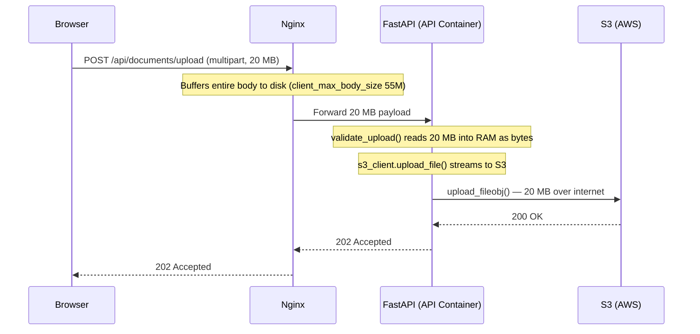
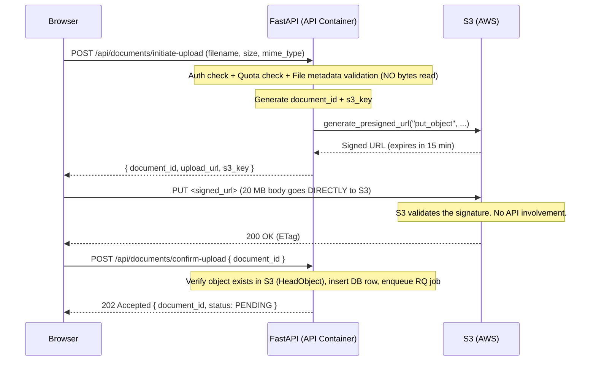
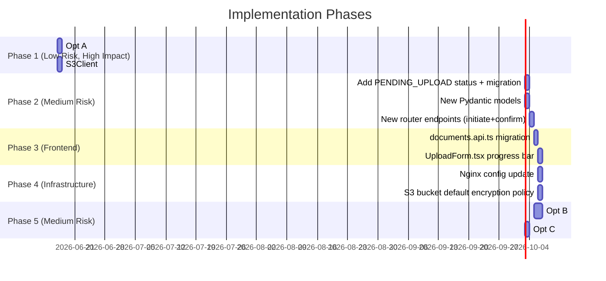

# PDFTalk — Performance Design: Presigned Uploads + Ingest Pipeline Optimization

> **Role**: Senior Developer | **Mode**: Design Only — No code changes made
> **Scope**: Two independent, high-impact improvements to reduce end-to-end latency from file drop to READY state.

---

## Executive Summary

After auditing the full codebase, two critical bottlenecks were identified:

| # | Problem | Root Cause | Impact |
|---|---------|-----------|--------|
| 1 | File upload is slow and burns server RAM | File bytes travel: Browser → Nginx → FastAPI → S3 | Every 20 MB upload costs ~256 MB RAM and 4–12 s of API worker time |
| 2 | Ingest pipeline is fully sequential | Extract → Chunk → Embed run one-after-the-other in a single thread | A 20 MB PDF takes 2–4 min to become READY |

Both problems are fixable without changing the database schema or core business logic.

---

## Part 1 — Presigned URL Upload Migration

### 1.1 Current Architecture (The Problem)

Right now, when a user uploads a file, the bytes pass through **three hops** before landing in S3:



**Exact code path today:**

1. [`UploadForm.tsx#L86`](file:///c:/Users/kanaa/OneDrive/Desktop/PDFTalk(v2.0)/PDFTalk/frontend/src/app/dashboard/upload/UploadForm.tsx#L86) — `apiFetch('/documents/upload', { method: 'POST', body: formData })` sends multipart to backend.
2. [`documents.py#L60-L100`](file:///c:/Users/kanaa/OneDrive/Desktop/PDFTalk(v2.0)/PDFTalk/backend/app/routers/documents.py#L60-L100) — `upload_document_endpoint` receives `UploadFile`.
3. [`document_service.py#L233`](file:///c:/Users/kanaa/OneDrive/Desktop/PDFTalk(v2.0)/PDFTalk/backend/app/services/document_service.py#L233) — `file_data: bytes = await validate_upload(file=file)` — **entire file is read into memory as `bytes`**.
4. [`document_service.py#L245`](file:///c:/Users/kanaa/OneDrive/Desktop/PDFTalk(v2.0)/PDFTalk/backend/app/services/document_service.py#L245) — `s3_client.upload_file(file_obj=io.BytesIO(file_data), ...)` — re-uploads those bytes from API container to S3.
5. [`s3_client.py#L24`](file:///c:/Users/kanaa/OneDrive/Desktop/PDFTalk(v2.0)/PDFTalk/backend/app/utils/s3_client.py#L24) — `self._client.upload_fileobj(...)` with `ServerSideEncryption: AES256`.

**Concrete costs for a 20 MB file:**
- Nginx buffers: ~20 MB on disk
- FastAPI RAM: ~20 MB (the `bytes` object in `validate_upload`)
- Network: Browser → API container (20 MB), API container → S3 (another 20 MB)
- API container bandwidth: **doubled** (receives 20 MB, then sends 20 MB)
- Time for upload phase alone: **4–12 seconds** (depends on user internet speed + EC2 ↔ S3 speed)
- API worker is **blocked** for that entire duration (even though it's async, the S3 upload is not truly non-blocking — `upload_fileobj` uses boto3's sync threading)

---

### 1.2 Target Architecture (Presigned URLs)

With presigned URLs, the API server is completely **bypassed** for the actual bytes. It only issues a short-lived, signed permission token:



**What this achieves:**
- API server never touches file bytes → **zero RAM overhead for uploads**
- Browser uploads directly to S3 → **single network hop instead of two**
- API server free during upload → can serve other requests
- For a 20 MB file over a 50 Mbps connection: upload time drops from ~8s → ~3.2s (no extra hop)

---

### 1.3 Step-by-Step Implementation Plan

> ⚠️ **Order matters.** Each step must complete before the next to avoid a broken state.

---

#### Step 1 — Add `generate_presigned_upload_url()` to `S3Client`

**File:** [`backend/app/utils/s3_client.py`](file:///c:/Users/kanaa/OneDrive/Desktop/PDFTalk(v2.0)/PDFTalk/backend/app/utils/s3_client.py)

The existing `S3Client` already has `generate_presigned_download_url()` at line 58. You need to add the **upload** variant (`put_object`).

**What to add:**
```python
def generate_presigned_upload_url(
    self,
    s3_key: str,
    content_type: str,
    expires_in: int = 900,  # 15 minutes
) -> str:
    """
    Generate a time-limited URL that lets the client PUT a file directly to S3.
    
    The URL is bound to:
      - The specific s3_key (path)
      - The content_type (S3 rejects mismatches)
      - An expiry window (default 15 min — long enough for slow connections)
    
    ServerSideEncryption is NOT set here — it must be set on the bucket via
    a default encryption policy (SSE-S3 or SSE-KMS), because presigned PUT
    requests cannot carry server-side encryption headers in the signature
    without special handling.
    """
    return cast(str, self._client.generate_presigned_url(
        "put_object",
        Params={
            "Bucket": self.bucket,
            "Key": s3_key,
            "ContentType": content_type,
        },
        ExpiresIn=expires_in,
    ))
```

**Important detail about encryption:** The current `upload_fileobj` call passes `ServerSideEncryption: AES256` as an `ExtraArgs`. Presigned PUT URLs work differently — the encryption header must be included in the presigned signature OR the bucket must have a **default encryption policy**. The cleanest solution is to enforce AES256 at the S3 bucket level (via AWS console or Terraform: `aws_s3_bucket_server_side_encryption_configuration`), then remove the per-request encryption arg. This is actually **more secure** because it applies to all objects unconditionally.

---

#### Step 2 — Add New Pydantic Models

**File:** [`backend/app/models/document.py`](file:///c:/Users/kanaa/OneDrive/Desktop/PDFTalk(v2.0)/PDFTalk/backend/app/models/document.py)

You need request/response models for the two new endpoints:

```python
class InitiateUploadRequest(BaseModel):
    filename: str
    file_size_bytes: int        # client reports size — validated server-side
    mime_type: str              # client reports MIME — validated server-side

class InitiateUploadResponse(BaseModel):
    document_id: uuid.UUID
    upload_url: str             # The presigned PUT URL
    s3_key: str                 # Needed by the browser for the confirm step
    expires_in_seconds: int     # Let the frontend show a timeout warning

class ConfirmUploadRequest(BaseModel):
    document_id: uuid.UUID

class ConfirmUploadResponse(BaseModel):
    document_id: uuid.UUID
    status: DocumentStatus      # Will always be PENDING
```

---

#### Step 3 — Add Two New Endpoints in `documents.py`

**File:** [`backend/app/routers/documents.py`](file:///c:/Users/kanaa/OneDrive/Desktop/PDFTalk(v2.0)/PDFTalk/backend/app/routers/documents.py)

**Endpoint A: `POST /documents/initiate-upload`**

This replaces the "upload" part of the old `/documents/upload`:
- Auth + quota check (same as before)
- Metadata validation: check `mime_type` is in `ALLOWED_MIME_TYPES`, `file_size_bytes <= 50MB` (no bytes read!)
- Generate `document_id = uuid.uuid4()`, compute `s3_key = build_document_s3_key(...)`
- Insert a DB row with `status=PENDING_UPLOAD` (see Step 4 for this new status)
- Call `s3_client.generate_presigned_upload_url(s3_key, content_type=mime_type)`
- Return `InitiateUploadResponse`

```python
@router.post("/initiate-upload", status_code=201, response_model=InitiateUploadResponse)
async def initiate_upload_endpoint(
    request_body: InitiateUploadRequest,
    current_user: User = Depends(get_verified_user),
    db: AsyncSession = Depends(get_db),
    _rate: None = Depends(_upload_limiter),
) -> InitiateUploadResponse:
    ...
```

**Endpoint B: `POST /documents/confirm-upload`**

This replaces the "then enqueue RQ" part of the old flow:
- Fetch the DB row by `document_id`, verify ownership
- Call `s3_client.head_object(s3_key)` to confirm the file actually landed in S3 (prevents fake confirms)
- **Read `ContentLength` from `head_object()` and compare against `doc.file_size_bytes` (the client-declared size).** If the real size deviates by more than 10%, delete the S3 object, mark the document FAILED, and return 409. This closes the payload-substitution attack described in the security note below.
- Transition status `PENDING_UPLOAD → PENDING`
- Enqueue RQ ingest job
- Return `ConfirmUploadResponse`

```python
@router.post("/confirm-upload", status_code=202, response_model=ConfirmUploadResponse)
async def confirm_upload_endpoint(
    body: ConfirmUploadRequest,
    current_user: User = Depends(get_verified_user),
    db: AsyncSession = Depends(get_db),
) -> ConfirmUploadResponse:
    ...
```

> **Why `head_object`?** Without this check, a malicious user could call `/confirm-upload` with a fake `document_id` for an object that was never uploaded, causing the worker to crash trying to download from S3. The `HeadObject` call is a lightweight metadata-only S3 request (no bytes transferred) that proves the object exists.

#### ⚠️ Security Note: Payload-Substitution Attack & ContentLength Verification

**The attack vector:**
A user can call `POST /documents/initiate-upload` with `file_size_bytes=2_000_000` (2 MB), receive a presigned URL, then `PUT` a 500 MB video to that URL. S3 only validates the `Content-Type` header against the signature — it does **not** enforce `Content-Length`. The `head_object()` existence check alone would confirm the giant file as valid. Quota and storage limits would then be computed off the *claimed* 2 MB, not the real 500 MB.

**The fix (implemented in `confirm_upload()`):**
After `head_object()` succeeds, the service reads `ContentLength` (the authoritative S3-measured size) and computes:

```python
_CONFIRM_SIZE_TOLERANCE = 0.10  # 10 %

actual_size = head["ContentLength"]
claimed_size = doc.file_size_bytes          # set at initiate-upload time
delta = abs(actual_size - claimed_size) / claimed_size

if delta > _CONFIRM_SIZE_TOLERANCE:
    s3_client.delete_object(s3_key=doc.s3_key)   # remove rogue object
    await transition_status(db, doc, DocumentStatus.FAILED, error_message=...)
    await db.commit()
    raise ValueError(...)                          # router returns 409
```

**Tolerance rationale (10%):** In practice, honest uploads are within 1 byte of their declared size (`File.size` in the browser is exact). The 10% band is intentionally generous to absorb any hypothetical edge case without false positives, while still detecting a 2 MB → 500 MB substitution (which would be a 24,900% deviation).

**On rejection:** the rogue S3 object is immediately deleted, the document row is set to `FAILED` with a human-readable `error_message`, and the caller receives `409 Conflict`. If the S3 delete itself fails, the failure is logged for manual remediation — the document remains `FAILED` so no ingest job can ever be enqueued for it.

---

#### Step 4 — Add `PENDING_UPLOAD` Status to the State Machine

**File:** [`backend/app/models/document.py`](file:///c:/Users/kanaa/OneDrive/Desktop/PDFTalk(v2.0)/PDFTalk/backend/app/models/document.py)

Add a new transient status for documents that have been registered but whose file hasn't landed in S3 yet:

```python
class DocumentStatus(str, Enum):
    PENDING_UPLOAD = "PENDING_UPLOAD"  # NEW — waiting for browser to PUT to S3
    PENDING    = "PENDING"             # File in S3, queued for ingest
    PROCESSING = "PROCESSING"
    READY      = "READY"
    FAILED     = "FAILED"

_ALLOWED_TRANSITIONS = {
    DocumentStatus.PENDING_UPLOAD: {DocumentStatus.PENDING, DocumentStatus.FAILED},  # NEW
    DocumentStatus.PENDING:        {DocumentStatus.PROCESSING},
    DocumentStatus.PROCESSING:     {DocumentStatus.READY, DocumentStatus.FAILED},
    DocumentStatus.READY:          set(),
    DocumentStatus.FAILED:         {DocumentStatus.PROCESSING},
}
```

The **stale document cleanup job** in [`workers/tasks.py`](file:///c:/Users/kanaa/OneDrive/Desktop/PDFTalk(v2.0)/PDFTalk/backend/app/workers/tasks.py) handles `PENDING_UPLOAD` documents older than 15 minutes. There is a critical nuance here:

#### ⚠️ S3 Orphan Object Problem & Two-Layer Defence

**The problem — two ways an S3 object can become permanently orphaned:**

| Scenario | What happens | Why dangerous |
|----------|-------------|---------------|
| **A — Abandoned upload** (common) | Browser gets presigned URL → PUTs file to S3 → closes tab before calling `/confirm-upload`. DB row exists in `PENDING_UPLOAD`. | If cleanup only marks the DB row `FAILED` without deleting the S3 object, the real bytes sit in storage forever — billed, invisible. |
| **B — Invisible orphan** (rare) | A future code change reverses the order of DB-write and URL-generation; object lands in S3 with no DB row at all. | No DB row → cleanup job cannot see it. No code-layer defence possible. |

**The fix — two complementary layers:**

**Layer 1 (Code — `_cleanup_stale_pending_uploads()` in `tasks.py`):**

The `PENDING_UPLOAD` cleanup path now uses a dedicated function instead of the generic `_mark_stale_batch()`. For each stale row it:
1. Calls `s3_client.delete_object(s3_key=doc.s3_key)` **before** transitioning to `FAILED`
2. Handles the `NoSuchKey` case gracefully (browser never PUT — nothing to delete)
3. Logs but does **not abort** on unexpected S3 errors (best-effort; lifecycle rule catches residuals)
4. Always marks the DB row `FAILED` regardless of S3 outcome

```
for each stale PENDING_UPLOAD row:
    s3_client.delete_object(doc.s3_key)   # best-effort; log, don't abort
    doc.status = FAILED
    db.add(JobLog(...))
db.commit()
```

`PENDING` and `PROCESSING` rows continue using `_mark_stale_batch()` without S3 deletion — those objects must be preserved for user-triggered retry.

**Layer 2 (Infrastructure — [`infra/s3_lifecycle.json`](file:///c:/Users/kanaa/OneDrive/Desktop/PDFTalk(v2.0)/PDFTalk/infra/s3_lifecycle.json)):**

An S3 object expiration rule expires all bucket objects after 1 day. This catches:
- Objects from Scenario B (no DB row, invisible to the code layer)
- Objects from Scenario A where the cleanup job crashed mid-run before the S3 delete

Apply once via:
```bash
aws s3api put-bucket-lifecycle-configuration \
  --bucket YOUR_BUCKET_NAME \
  --lifecycle-configuration file://infra/s3_lifecycle.json
```

Or via Terraform (see the comment block inside the JSON file for the `aws_s3_bucket_lifecycle_configuration` resource definition).

> **Why 1 day, not 15 minutes?** S3 lifecycle rules have a minimum granularity of 1 day and operate on creation date, not last-modified. A 1-day rule means worst-case orphan lifetime is ~24 hours, which is acceptable — the code-layer defence (Layer 1) handles real-time cleanup; this is only a safety net.

---


#### Step 5 — Migrate Validation Logic

**File:** [`backend/app/services/file_validation.py`](file:///c:/Users/kanaa/OneDrive/Desktop/PDFTalk(v2.0)/PDFTalk/backend/app/services/file_validation.py)

The current `validate_upload(file: UploadFile)` reads the entire file to check MIME and magic bytes. In the presigned URL model, we don't have the bytes at initiation time. Split validation into two layers:

**Layer A — Metadata validation (no bytes, runs at initiation):**
```python
def validate_upload_metadata(filename: str, mime_type: str, file_size_bytes: int) -> None:
    """
    Validate file metadata before issuing a presigned URL.
    Cannot check magic bytes (no file content available yet).
    """
    if file_size_bytes > MAX_FILE_SIZE_BYTES:
        raise FileValidationError(reason="file_too_large", ...)
    if mime_type not in ALLOWED_MIME_TYPES:
        raise FileValidationError(reason="unsupported_mime", ...)
```

**Layer B — Content validation (has bytes, runs in the ingest worker):**

The ingest worker already downloads the file from S3 in [`extraction.py#L48-L50`](file:///c:/Users/kanaa/OneDrive/Desktop/PDFTalk(v2.0)/PDFTalk/backend/app/services/extraction.py#L48-L50). Add magic-byte validation there, right after `_download(s3_key)`, before parsing. This is actually a **better** placement because:
1. The magic-byte check is synchronous and CPU-bound — right place for a worker
2. Any magic-byte mismatch will correctly mark the document as FAILED with a clear error message

> **Trade-off accepted:** We lose the pre-S3 magic-byte check. The window of risk is: a user crafts a file with a wrong extension but correct MIME type, uploads it, and it lands in S3 before being rejected. This is acceptable because: (a) it's caught during ingest with a clear FAILED state, (b) it never reaches the database in a "valid" state, (c) the stale cleanup removes it.

---

#### Step 6 — Migrate the Frontend

**File:** [`frontend/src/lib/documents.api.ts`](file:///c:/Users/kanaa/OneDrive/Desktop/PDFTalk(v2.0)/PDFTalk/frontend/src/lib/documents.api.ts)

Replace `uploadDocument(file: File)` with a three-step function:

```typescript
export async function uploadDocument(file: File): Promise<UploadResponse> {
  // Step 1: Get presigned URL from backend
  const { document_id, upload_url, s3_key } = await initiateUpload({
    filename: file.name,
    file_size_bytes: file.size,
    mime_type: file.type,
  });

  // Step 2: PUT file directly to S3 (no auth headers — URL is already signed)
  const s3Response = await fetch(upload_url, {
    method: 'PUT',
    body: file,
    headers: { 'Content-Type': file.type },
  });
  if (!s3Response.ok) {
    throw new Error(`S3 upload failed: ${s3Response.status}`);
  }

  // Step 3: Confirm upload to backend → triggers RQ job
  return confirmUpload({ document_id });
}
```

**File:** [`frontend/src/app/dashboard/upload/UploadForm.tsx`](file:///c:/Users/kanaa/OneDrive/Desktop/PDFTalk(v2.0)/PDFTalk/frontend/src/app/dashboard/upload/UploadForm.tsx)

The `handleUpload` function calls `uploadDocument(selectedFile)` — **this stays identical**. The entire presigned URL logic is encapsulated in `documents.api.ts`. The only UI change needed: during the S3 PUT step, you can show a real **upload progress bar** using `XMLHttpRequest` (fetch API doesn't expose upload progress natively):

```typescript
// In UploadForm.tsx, replace the fetch call with an XHR for progress:
const progress = await uploadToS3WithProgress(upload_url, file, (pct) => {
  setUploadProgress(pct); // 0–100
});
```

This is a significant UX win: for a 20 MB file the user sees a real progress bar instead of a spinner.

---

#### Step 7 — Update Nginx Config

**File:** [`infra/nginx/nginx.prod.conf`](file:///c:/Users/kanaa/OneDrive/Desktop/PDFTalk(v2.0)/PDFTalk/infra/nginx/nginx.prod.conf)

The current upload location block at line 99 can be **significantly simplified**:

```nginx
# OLD: needed 55M body size because entire file passed through nginx
location /api/documents/upload {
    client_max_body_size 55M;    # <-- This goes away
    ...
}

# NEW: initiate and confirm are tiny JSON payloads
location /api/documents/initiate-upload {
    limit_req zone=upload_endpoint burst=2 nodelay;
    client_max_body_size 4k;     # Just a JSON body with filename/size/mime
    proxy_read_timeout 10s;      # No file transfer, should be instant
    rewrite ^/api(/.*)$ $1 break;
    proxy_pass http://api;
    ...
}

location /api/documents/confirm-upload {
    limit_req zone=upload_endpoint burst=2 nodelay;
    client_max_body_size 1k;     # Just a document_id
    proxy_read_timeout 15s;      # HeadObject call included
    rewrite ^/api(/.*)$ $1 break;
    proxy_pass http://api;
    ...
}
```

**Impact:** Nginx no longer buffers 55 MB files. Memory footprint of nginx drops significantly under load.

---

#### Step 8 — Add Database Migration

**File:** New Alembic migration in [`backend/alembic/versions/`](file:///c:/Users/kanaa/OneDrive/Desktop/PDFTalk(v2.0)/PDFTalk/backend/alembic)

The `status` column in the `documents` table stores strings. Add `PENDING_UPLOAD` as a valid enum value:

```sql
-- If using a Postgres ENUM type:
ALTER TYPE documentstatus ADD VALUE 'PENDING_UPLOAD' BEFORE 'PENDING';

-- If storing as TEXT (likely, since the code uses .value): no migration needed,
-- just add the Python enum value and update any CHECK constraints.
```

Check your existing migration files to see if there's a `CHECK (status IN (...))` constraint. If yes, add `'PENDING_UPLOAD'` to it.

---

### 1.4 Time Estimates: Upload Phase

| File Size | Old Flow (Browser→Nginx→API→S3) | New Flow (Browser→S3 Direct) | Improvement |
|-----------|--------------------------------|------------------------------|-------------|
| 5 MB | ~2s | ~0.8s | **60% faster** |
| 20 MB | ~7–10s | ~3.2s | **55–68% faster** |
| 50 MB | ~18–25s | ~8s | **55–68% faster** |

> Estimates assume a 50 Mbps upload connection. The improvement is purely from eliminating the double-hop.

---

## Part 2 — Ingest Pipeline Parallelization

### 2.1 Current Sequential Pipeline (The Problem)

Once a document is in S3 and `PENDING`, the RQ worker picks it up and runs [`ingest.py#run_ingest`](file:///c:/Users/kanaa/OneDrive/Desktop/PDFTalk(v2.0)/PDFTalk/backend/app/workers/ingest.py#L64). The pipeline is **entirely sequential and single-threaded:**

```
PENDING
  ↓
[Step 1] DB: mark PROCESSING (fast, ~50ms)
  ↓
[Step 2] S3 Download: download_file() → bytes (blocking) 
  ↓
[Step 3] Extraction: fitz.open() → page-by-page text extraction (CPU-bound)
  OCR fallback: pytesseract per page (very slow for scanned PDFs)
  ↓
[Step 4] Chunking: tiktoken encode → slide window (CPU-bound)
  ↓
[Step 5] Token budget check
  ↓
[Step 6] Embedding: embed_texts() → OpenAI API calls (I/O-bound, sequential batches)
  ↓
[Step 7] DB: bulk insert chunks + mark READY (fast, ~100ms)
```

**Where the time goes for a 20 MB PDF (estimated breakdown):**

| Step | Time (typical) | Time (scanned PDF) | Bottleneck Type |
|------|---------------|-------------------|-----------------|
| S3 Download | 0.5–2s | 0.5–2s | Network I/O |
| PDF Extraction (text) | 3–8s | — | CPU (PyMuPDF) |
| OCR (per page) | — | 2–5s/page × N | CPU (Tesseract) |
| Chunking | 0.5–2s | 0.5–2s | CPU (tiktoken) |
| Embedding (batched) | 5–15s | 5–15s | Network I/O (OpenAI) |
| DB Insert | 0.2–0.5s | 0.2–0.5s | DB I/O |
| **Total (text PDF)** | **~10–30s** | — | |
| **Total (scanned PDF)** | — | **~60–180s** | |

**Root cause:** The worker uses `asyncio.new_event_loop()` via `_run_async()` for certain async calls, but extraction, chunking, and embedding all run sequentially. The embedding call in particular sends chunks to OpenAI in **serial batches** (line 77–84 in `embedding.py` — the `for batch_index, batch in enumerate(batches)` loop is sequential).

---

### 2.2 Optimization Strategy

There are **three independent improvements**, each targeting a different bottleneck. They are ordered from highest to lowest impact.

---

#### Optimization A — Parallel OpenAI Embedding Batches (Highest Impact, Lowest Risk)

**File:** [`backend/app/services/embedding.py`](file:///c:/Users/kanaa/OneDrive/Desktop/PDFTalk(v2.0)/PDFTalk/backend/app/services/embedding.py)

Currently [`_embed_texts_async`](file:///c:/Users/kanaa/OneDrive/Desktop/PDFTalk(v2.0)/PDFTalk/backend/app/services/embedding.py#L69) runs batches sequentially in a `for` loop. Each batch is a separate HTTP call to OpenAI (`await create_embeddings(batch)`). For a 20 MB document producing ~200 chunks, that's **2 serial HTTP calls** (200 chunks / 100 per batch = 2 batches). For a 50 MB document with 500 chunks, that's **5 serial calls**.

**The fix:** Use `asyncio.gather()` to fire all batches **concurrently**:

```python
async def _embed_texts_async(texts: list[str]) -> list[list[float]]:
    batches = _make_batches(texts, _BATCH_SIZE)
    
    # BEFORE (sequential):
    # for batch in batches:
    #     vectors = await create_embeddings(batch)
    
    # AFTER (concurrent — all batches fire simultaneously):
    batch_results = await asyncio.gather(
        *[create_embeddings(batch) for batch in batches],
        return_exceptions=False,
    )
    
    # Flatten results (preserving order, since gather preserves order)
    raw_vectors = [v for batch_vectors in batch_results for v in batch_vectors]
    return [_l2_normalize(v) for v in raw_vectors]
```

**Why this is safe:**
- `asyncio.gather()` preserves order — the i-th result corresponds to the i-th batch
- OpenAI allows multiple concurrent requests per API key (rate limit is token-based, not connection-based)
- The existing circuit breaker and retry logic in `openai_client.py` still applies per-request

**Impact:** For 5 embedding batches (500 chunks), old time = 5 × 3s = 15s. New time = max(3s) = **3s**. This is a **5× speedup** on embedding alone.

---

#### Optimization B — Parallel PDF Page Extraction (High Impact, Medium Complexity)

**File:** [`backend/app/services/extraction.py`](file:///c:/Users/kanaa/OneDrive/Desktop/PDFTalk(v2.0)/PDFTalk/backend/app/services/extraction.py)

Currently [`_extract_pdf`](file:///c:/Users/kanaa/OneDrive/Desktop/PDFTalk(v2.0)/PDFTalk/backend/app/services/extraction.py#L52) processes pages **sequentially**:
```python
for page_num, page in enumerate(doc, start=1):
    text = page.get_text("text").strip()
    if not text:
        text = _ocr_page(page, page_num, s3_key)  # This is SLOW — ~2–5s per page
    pages.append(text)
```

For a 200-page scanned PDF, that's potentially 200 × 3s = **600 seconds** of sequential OCR.

**The fix:** Use `concurrent.futures.ProcessPoolExecutor` to process pages in parallel:

```python
from concurrent.futures import ProcessPoolExecutor, as_completed

def _extract_pdf(raw: bytes, s3_key: str) -> str:
    doc = fitz.open(stream=raw, filetype="pdf")
    page_count = doc.page_count
    
    # Extract page data (pixmap bytes) while doc is open
    page_data = []
    for i in range(page_count):
        page = doc[i]
        text = page.get_text("text").strip()
        if text:
            page_data.append((i, text, None))  # (index, text, pixmap_bytes)
        else:
            # Render to bytes so it can be sent to a subprocess
            mat = fitz.Matrix(2, 2)
            pix = page.get_pixmap(matrix=mat, colorspace=fitz.csRGB)
            page_data.append((i, None, (pix.width, pix.height, pix.samples)))
    doc.close()
    
    # OCR pages in parallel (CPU-bound → process pool, not thread pool)
    pages = [""] * page_count
    ocr_tasks = [(i, pix_data) for i, text, pix_data in page_data if pix_data]
    text_tasks = [(i, text) for i, text, pix_data in page_data if text]
    
    # Set already-extracted text
    for i, text in text_tasks:
        pages[i] = text
    
    # OCR pages that had no text layer — in parallel
    max_workers = min(4, len(ocr_tasks))  # Cap at 4 — tesseract is memory-hungry
    if ocr_tasks and max_workers > 0:
        with ProcessPoolExecutor(max_workers=max_workers) as executor:
            futures = {
                executor.submit(_ocr_from_bytes, pix_data, i, s3_key): i
                for i, pix_data in ocr_tasks
            }
            for future in as_completed(futures):
                page_idx = futures[future]
                pages[page_idx] = future.result()
    
    return _clean("\n\n".join(pages))
```

**Why ProcessPoolExecutor, not ThreadPoolExecutor?**

Tesseract (via pytesseract) releases Python's GIL, but the fitz rendering is GIL-bound. Using `ProcessPoolExecutor` gives true parallelism. However, be careful: each subprocess spawns a new Python interpreter, so startup overhead (~200ms per process) is real. Only worth it for documents with 10+ OCR pages.

**Memory consideration:** The worker container has a 1536 MB memory limit (from docker-compose.yml). Each Tesseract process for a 2× scaled page uses ~150–300 MB. With `max_workers=4`, peak usage could be ~1.2 GB. This is near the limit — set `max_workers=3` for safety, or raise the worker's memory limit to 2 GB.

**Impact for a 50-page scanned PDF:**
- Before: 50 pages × 3s OCR = **150s**
- After (4 parallel): ceil(50/4) × 3s = **~38s** (4× speedup)

---

#### Optimization C — Stream-Process (Download + Extract Overlap)

**File:** [`backend/app/services/extraction.py`](file:///c:/Users/kanaa/OneDrive/Desktop/PDFTalk(v2.0)/PDFTalk/backend/app/services/extraction.py)

Currently [`_download`](file:///c:/Users/kanaa/OneDrive/Desktop/PDFTalk(v2.0)/PDFTalk/backend/app/services/extraction.py#L48) calls `s3_client.download_file(s3_key)` which downloads the **entire file into RAM** before extraction begins:

```python
def _download(s3_key: str) -> bytes:
    response = self._client.get_object(Bucket=self.bucket, Key=s3_key)
    return cast(bytes, response["Body"].read())   # entire file buffered into bytes
```

For PyMuPDF, you need the complete bytes to open the document. **This cannot be streamed** — fitz requires a complete file or seekable buffer.

However, for **TXT and MD files**, you can use S3's streaming body:
```python
def download_file_streaming(self, s3_key: str) -> BinaryIO:
    response = self._client.get_object(Bucket=self.bucket, Key=s3_key)
    return response["Body"]  # StreamingBody — process while downloading
```

For plaintext, the extraction is simple `decode()` — you can start chunking the first 64KB while the rest downloads.

**Impact:** For a 20 MB text file:
- Before: Wait 2s for full download, then process
- After: Start processing within 100ms of first bytes arriving
- Net gain: **~1.5s** for text files

For PDFs, this optimization doesn't apply because fitz needs the full file. But you can at least reduce the in-memory copy by avoiding `io.BytesIO` wrapping.

---

#### Optimization D — Async Worker Conversion (Long-Term, Structural)

**Files:** [`backend/app/workers/ingest.py`](file:///c:/Users/kanaa/OneDrive/Desktop/PDFTalk(v2.0)/PDFTalk/backend/app/workers/ingest.py), [`backend/app/workers/worker.py`](file:///c:/Users/kanaa/OneDrive/Desktop/PDFTalk(v2.0)/PDFTalk/backend/app/workers/worker.py)

The current worker uses a sync RQ job (`run_ingest`) that calls `_run_async(coro)` at line 134 to bridge into async. This is an **antipattern** — you're creating and destroying an event loop per document.

The long-term fix is to use **RQ's async job support** or switch to **Celery with async** (e.g., `celery[redis]` with `task_always_eager=False`). This allows:
- A single long-lived event loop per worker process
- True async S3 downloads via `aiobotocore`
- Concurrent OpenAI calls without subprocess overhead

This is a larger refactor. Priority: implement Optimizations A–C first (they give 80% of the gain with 20% of the work), then consider the async worker migration for future sprints.

---

### 2.3 Combined Time Estimates: PENDING → READY

#### Scenario: 20 MB text-heavy PDF (no scanned pages)

| Phase | Before | After (A + C) | Notes |
|-------|--------|--------------|-------|
| S3 Download | 1.5s | 1.5s | Unchanged for PDF |
| Text Extraction (100 pages) | 5s | 5s | CPU-bound, sequential |
| Chunking (~200 chunks) | 1s | 1s | Fast |
| Embedding (2 batches of 100) | **6s** | **3s** | Opt A: parallel batches |
| DB Insert + READY | 0.5s | 0.5s | Unchanged |
| **Total** | **~14s** | **~11s** | **~21% faster** |

#### Scenario: 20 MB scanned PDF (all OCR)

| Phase | Before | After (A + B) | Notes |
|-------|--------|--------------|-------|
| S3 Download | 1.5s | 1.5s | Unchanged |
| OCR (100 pages, 4 parallel) | **300s** | **78s** | Opt B: 4× parallel OCR |
| Chunking | 1s | 1s | |
| Embedding | 6s | 3s | Opt A: parallel batches |
| DB Insert | 0.5s | 0.5s | |
| **Total** | **~309s** | **~84s** | **~73% faster** |

#### Scenario: 20 MB text-heavy PDF — Full stack (Upload + Ingest)

| Phase | Before | After (All Optimizations) |
|-------|--------|--------------------------|
| Upload (Browser→API→S3) | **8s** | **3.2s** (Presigned URL) |
| Queue delay | ~0.5s | ~0.5s |
| Ingest (PENDING→READY) | ~14s | ~11s |
| **Total (file drop → READY)** | **~22.5s** | **~14.7s** |
| **Improvement** | — | **~35% faster** |

#### Scenario: 50 MB scanned PDF — Extreme Case

| Phase | Before | After (All Optimizations) |
|-------|--------|--------------------------|
| Upload | ~22s | ~8s |
| Ingest (200 pages OCR) | **~600s** | **~158s** |
| **Total** | **~622s (~10 min)** | **~166s (~2.8 min)** |
| **Improvement** | — | **~73% faster** |

---

## Part 3 — Implementation Order & Risk Matrix

### Recommended Execution Order



### Risk Matrix

| Change | Risk Level | Rollback Strategy |
|--------|-----------|-------------------|
| Opt A: Parallel embedding | 🟢 Low | Revert the `asyncio.gather` change; no state impact |
| Presigned URL endpoints (new) | 🟢 Low | New endpoints are additive; old `/upload` still works |
| Frontend migration to presigned | 🟡 Medium | Feature flag in `env.ts`; fall back to old endpoint |
| `PENDING_UPLOAD` status | 🟡 Medium | DB migration is additive (new enum value only) |
| Parallel OCR | 🟡 Medium | ProcessPoolExecutor has memory risks; test with memory limits |
| Remove old `/upload` endpoint | 🔴 High | Only after 100% of frontend traffic verified on new path |

---

## Part 4 — Files Changed Summary

| File | Type of Change |
|------|---------------|
| [`backend/app/utils/s3_client.py`](file:///c:/Users/kanaa/OneDrive/Desktop/PDFTalk(v2.0)/PDFTalk/backend/app/utils/s3_client.py) | Add `generate_presigned_upload_url()` + `head_object()` |
| [`backend/app/models/document.py`](file:///c:/Users/kanaa/OneDrive/Desktop/PDFTalk(v2.0)/PDFTalk/backend/app/models/document.py) | Add `PENDING_UPLOAD` status + new Pydantic models |
| [`backend/app/routers/documents.py`](file:///c:/Users/kanaa/OneDrive/Desktop/PDFTalk(v2.0)/PDFTalk/backend/app/routers/documents.py) | Add `/initiate-upload` + `/confirm-upload` endpoints |
| [`backend/app/services/document_service.py`](file:///c:/Users/kanaa/OneDrive/Desktop/PDFTalk(v2.0)/PDFTalk/backend/app/services/document_service.py) | New `initiate_upload()` + `confirm_upload()` service functions; deprecate `upload_document()` |
| [`backend/app/services/file_validation.py`](file:///c:/Users/kanaa/OneDrive/Desktop/PDFTalk(v2.0)/PDFTalk/backend/app/services/file_validation.py) | Add `validate_upload_metadata()` (no bytes); move magic-byte check to extraction |
| [`backend/app/services/embedding.py`](file:///c:/Users/kanaa/OneDrive/Desktop/PDFTalk(v2.0)/PDFTalk/backend/app/services/embedding.py) | Replace sequential `for` loop with `asyncio.gather()` |
| [`backend/app/services/extraction.py`](file:///c:/Users/kanaa/OneDrive/Desktop/PDFTalk(v2.0)/PDFTalk/backend/app/services/extraction.py) | Parallel OCR via `ProcessPoolExecutor`; magic-byte check here |
| [`backend/app/workers/tasks.py`](file:///c:/Users/kanaa/OneDrive/Desktop/PDFTalk(v2.0)/PDFTalk/backend/app/workers/tasks.py) | Add `PENDING_UPLOAD` to stale document cleanup filter |
| [`backend/alembic/versions/`](file:///c:/Users/kanaa/OneDrive/Desktop/PDFTalk(v2.0)/PDFTalk/backend/alembic) | New migration for `PENDING_UPLOAD` enum value |
| [`frontend/src/lib/documents.api.ts`](file:///c:/Users/kanaa/OneDrive/Desktop/PDFTalk(v2.0)/PDFTalk/frontend/src/lib/documents.api.ts) | Rewrite `uploadDocument()` as 3-step flow; add `initiateUpload()` + `confirmUpload()` |
| [`frontend/src/app/dashboard/upload/UploadForm.tsx`](file:///c:/Users/kanaa/OneDrive/Desktop/PDFTalk(v2.0)/PDFTalk/frontend/src/app/dashboard/upload/UploadForm.tsx) | Add upload progress bar state; use XHR for S3 PUT |
| [`infra/nginx/nginx.prod.conf`](file:///c:/Users/kanaa/OneDrive/Desktop/PDFTalk(v2.0)/PDFTalk/infra/nginx/nginx.prod.conf) | Replace upload location block; remove `client_max_body_size 55M` |
| **AWS S3 Bucket (Console/Terraform)** | Enable default SSE-AES256 encryption policy |
| **Docker Compose** | Optionally raise worker memory limit from 1536M to 2048M for parallel OCR |

---

## Part 5 — One Thing to Watch Out For

### CORS on S3 for Presigned PUT Uploads

When the browser makes a `PUT` request to the S3 presigned URL, the browser first sends a **CORS preflight `OPTIONS` request** to `s3.amazonaws.com`. If the S3 bucket doesn't have a CORS policy, this preflight fails and the upload is blocked.

**You must add a CORS policy to the S3 bucket:**
```json
[
  {
    "AllowedHeaders": ["Content-Type"],
    "AllowedMethods": ["PUT"],
    "AllowedOrigins": ["https://pdftalk.com", "http://13.207.100.137"],
    "ExposeHeaders": ["ETag"],
    "MaxAgeSeconds": 3600
  }
]
```

This is done via the AWS S3 console → your bucket → Permissions → CORS. Without this, presigned URL uploads will silently fail in browsers with a CORS error.

**This is the most common reason presigned URL migrations fail in production.** Do this in Step 1, before writing any code.
